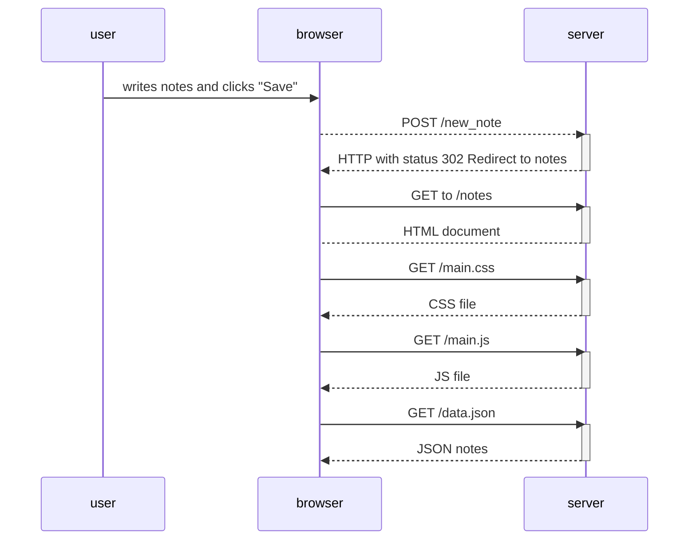

```mermaid
sequenceDiagram
    participant user
    participant browser
    participant server

    user->>browser: writes notes and clicks "Save"
    browser-->>server: POST /new_note
    activate server
    server-->>browser: HTTP with status 302 Redirect to notes
    deactivate server
    browser->>server: GET to /notes
    activate server
    server-->browser: HTML document
    deactivate server
    browser->>server: GET /main.css
    activate server
    server-->>browser: CSS file
    deactivate server
    browser->>server: GET /main.js
    activate server
    server-->>browser: JS file
    deactivate server
    browser->>server: GET /data.json
    activate server
    server-->>browser: JSON notes
    deactivate server

  

```
