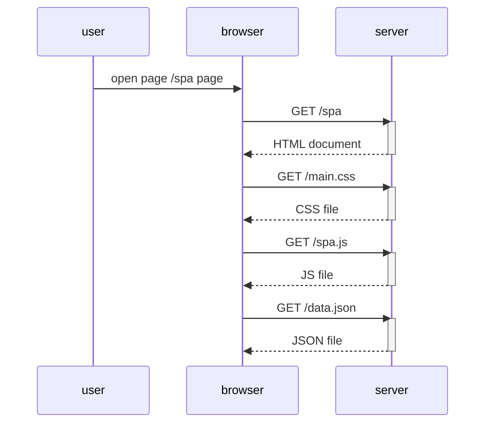

```mermaid
sequenceDiagram
    participant user
    participant browser
    participant server

    user->>browser: open page /spa page

    browser->>server: GET /spa
    activate server
    server-->>browser: HTML document
    deactivate server
    browser->>server: GET /main.css
    activate server
    server-->>browser: CSS file
    deactivate server
    browser->>server: GET /spa.js
    activate server
    server-->>browser: JS file
    deactivate server
    browser->>server: GET /data.json
    activate server
    server-->>browser: JSON file
    deactivate server
    


```  